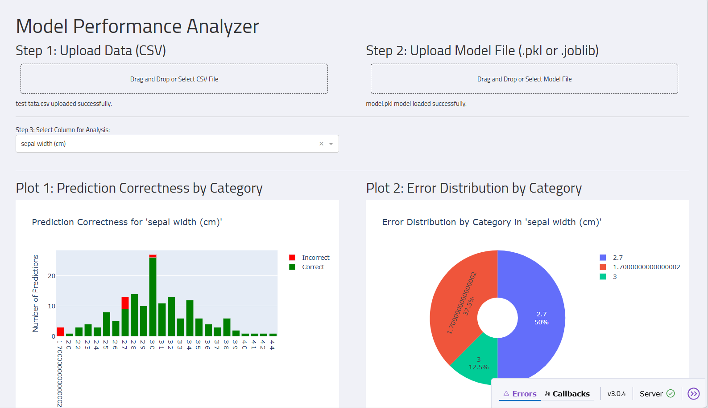

# SKY AI 🌤️ – Your Friendly Machine Learning Platform

> A user-friendly web application powered by **Dash** and **Plotly** that helps users build, train, and evaluate machine learning models with ease.

---

## 🧭 Table of Contents

- [About the Project](#about-the-project)
- [Features](#features)
- [How It Works](#how-it-works)
- [Screenshots](#screenshots)
- [Getting Started](#getting-started)
  - [Prerequisites](#prerequisites)
  - [Installation](#installation)
- [Usage](#usage)
- [Project Structure](#project-structure)
- [Built With](#built-with)
- [Contributing](#contributing)
- [License](#license)

---

## 🧩 About the Project

**SKY AI** is a full-stack web application designed to simplify the machine learning workflow for both beginners and experts. From data visualization to model training and performance analysis, SKY AI guides users through every step in an intuitive and interactive way.

This platform allows users to:

- Upload datasets (CSV/Excel).
- Visualize data patterns.
- Generate detailed reports.
- Clean and preprocess data.
- Train ML and deep learning models.
- Evaluate model performance visually.

---

## ⚙️ Features

- **Interactive Data Visualization**: Histograms, scatter plots, 3D visualizations.
- **Comprehensive Data Reports**: Missing values, outliers, correlations.
- **Data Preprocessing Tools**: Scaling, encoding, handling missing values.
- **Model Training Options**:
  - Traditional ML Models (Random Forest, Logistic Regression, etc.)
  - Deep Learning Models (Keras/TensorFlow)
- **Performance Analysis**: Confusion matrix, accuracy charts, error distribution.

---

## 🔍 How It Works

1. **Upload Data**: Drag & drop CSV or Excel files.
2. **Explore Data**: Interactive plots and summary statistics.
3. **Generate Report**: Get insights about missing values, outliers, and correlations.
4. **Clean Data**: Apply preprocessing steps like imputation, scaling, and encoding.
5. **Train Model**: Choose between ML or DL models.
6. **Evaluate Model**: View metrics and visualizations of model performance.

---

## 🖼️ Screenshots




---

## 🛠️ Getting Started

### Prerequisites

Before running the project, ensure you have the following installed:

- Python 3.x
- pip (Python package manager)
- Node.js (for Dash frontend components)

---

### Installation

1. Clone the repository:

   ```bash
   git clone https://github.com/yourusername/sky-ai.git
   cd sky-ai
   ```

2. Install dependencies:

   ```bash
   pip install -r requirements.txt
   ```

3. Run the app:

   ```bash
   python app.py
   ```

4. Open your browser and navigate to `http://localhost:8050`.

---

## 🧪 Usage

Use the UI to:

- Upload and explore your dataset.
- Generate reports.
- Preprocess and download cleaned data.
- Train and evaluate models.

---

## 📁 Project Structure

```
sky-ai/
│
├── app.py                  # Main Dash app
├── data/                   # Folder for uploaded datasets
├── models/                 # Trained models saved here
├── assets/                 # CSS, images, and static files
├── components/             # Reusable Dash components
├── utils/                  # Helper functions (data cleaning, model training)
└── README.md               # This file
```

---

## 🧰 Built With

- [Dash](https://dash.plotly.com/) – Framework for building analytical web applications.
- [Plotly](https://plotly.com/python/) – For interactive data visualizations.
- [Pandas](https://pandas.pydata.org/) – Data manipulation and analysis.
- [Scikit-learn](https://scikit-learn.org/stable/) – Machine learning tools.
- [TensorFlow/Keras](https://www.tensorflow.org/) – Deep learning framework.
- [Flask](https://flask.palletsprojects.com/) – Web server backend.

---

## 🤝 Contributing

Contributions are welcome! Please read our [contributing guidelines](CONTRIBUTING.md) before submitting a pull request.

---

## 📄 License

This project is licensed under the MIT License – see the [LICENSE](LICENSE) file for details.

---

## ❤️ Acknowledgments

- Inspired by open-source dashboards and educational platforms.
- Thanks to the Plotly and Dash community for their amazing tools.

---

> Made with 💡 by [Your Name or Company]  
```

---


```txt
dash
dash-bootstrap-components
pandas
numpy
scikit-learn
tensorflow
plotly
```


