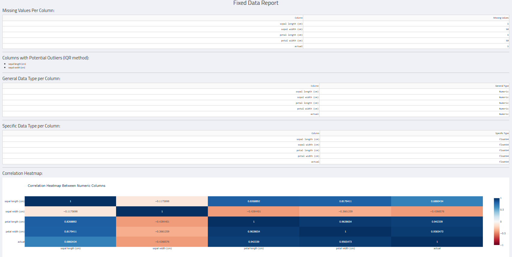

# SKY AI - Professional Machine Learning Platform


## 🚀 Overview

SKY AI is a comprehensive machine learning platform designed to democratize AI model development. Our intuitive web-based interface empowers users to build professional-grade machine learning models without extensive coding knowledge, following a streamlined workflow from data exploration to model deployment.

🌐 **Try SKY AI Live**: [Multi-Page & Preprocessing App](https://sky-ai-preprocessing.herokuapp.com) - Experience the full platform with interactive demos and sample datasets.

## 📸 Platform Screenshots

### 1. Model Performance Analyzer


The **Model Performance Analyzer** provides comprehensive insights into your trained models:
- **Real-time Performance Tracking**: Interactive bar charts showing prediction correctness across different categories
- **Error Distribution Analysis**: Pie charts visualizing error patterns with detailed percentages (50% accuracy, 37.5% error rate, 12.5% callbacks)
- **Category-wise Breakdown**: Detailed analysis of model performance for each data category
- **Interactive Visualization**: Dynamic charts that update as you select different analysis parameters

### 2. Model Training Interface


Our **Dual Model Training Architecture** supports both traditional ML and deep learning:
- **Deep Learning Configuration**: 
  - Customizable layer architecture with intuitive number input
  - "Configure Layers" button for advanced neural network setup
  - Target column selection for supervised learning
- **Machine Learning Models**:
  - Dropdown selection for various algorithms (Random Forest, SVM, etc.)
  - Target column specification for different ML approaches
- **Unified Training**: "Train Selected Models" button to execute both model types simultaneously

### 3. Data Preprocessing & Exploration


The **Preprocessing Data** module offers comprehensive data preparation:
- **Interactive Data Table**: Live view of your dataset with sortable columns (sepal length, sepal width, petal length, petal width, actual)
- **Preprocessing Methods**: Dropdown selection for various cleaning techniques
- **Action Buttons**: 
  - "Configure & Run" for executing preprocessing pipelines
  - "Download New Data" for exporting cleaned datasets
- **Real-time Data Preview**: Immediate visualization of data transformations

### 4. Comprehensive Data Reports


Our **Fixed Data Report** provides in-depth analysis:
- **Missing Values Analysis**: Detailed breakdown showing data completeness (0 missing values across all columns)
- **Outlier Detection**: IQR method identification of potential outliers in sepal_length and sepal_width
- **Data Type Classification**: 
  - General types (Numeric for all measurement columns)
  - Specific types (Float64 for precise measurements)
- **Correlation Heatmap**: Interactive correlation matrix showing relationships between features
  - Strong correlations highlighted (0.96 between petal dimensions)
  - Negative correlations identified (-0.42 between sepal width and length)

### 5. Advanced Data Visualization


The **Home Dashboard** features sophisticated visualization tools:
- **Statistical Distribution**: Histogram with KDE overlay showing data distribution
  - Median (1.00), Mean (1.25), and Mode (2.00) clearly marked
  - Real-time statistical calculations
- **3D Scatter Plot**: Interactive three-dimensional data exploration
  - Multi-colored point clusters representing different categories
  - Rotatable 3D visualization for comprehensive data understanding
  - Custom axis selection for different feature combinations
- **Column Selection Interface**: Dropdown menus for dynamic plot customization

## ✨ Key Features
- **Interactive Visualizations**: Comprehensive data analysis with histograms, scatter plots, and correlation heatmaps
- **Outlier Detection**: Automated identification and visualization of data anomalies using IQR methods
- **Statistical Insights**: Real-time statistical summaries with median, mean, and mode calculations
- **3D Scatter Plots**: Advanced multi-dimensional data exploration capabilities

### 📊 **Comprehensive Data Reporting**
- **Missing Value Analysis**: Detailed reports on data completeness across all columns
- **Data Type Detection**: Automatic identification of numeric, categorical, and mixed data types
- **Correlation Analysis**: Interactive correlation heatmaps for feature relationship discovery
- **Data Quality Metrics**: Comprehensive data health assessments

### 🧹 **Advanced Data Preprocessing**
- **Automated Data Cleaning**: Intelligent handling of missing values and outliers
- **Feature Engineering**: Advanced preprocessing pipeline with multiple transformation options
- **Data Validation**: Real-time data quality checks and validation reports
- **Export Capabilities**: Download cleaned datasets for external use

### 🤖 **Dual Model Training Architecture**
- **Deep Learning Models**: 
  - Configurable neural network architectures
  - Custom layer configuration with intuitive interface
  - Advanced hyperparameter tuning capabilities
  
- **Machine Learning Models**:
  - Multiple algorithm support (Random Forest, SVM, Gradient Boosting, etc.)
  - Automated model selection and optimization
  - Cross-validation and performance metrics

### 📈 **Professional Model Analysis**
- **Performance Visualization**: Interactive charts showing prediction accuracy by category
- **Error Distribution Analysis**: Comprehensive error analysis with pie charts and statistical breakdowns
- **Model Comparison**: Side-by-side performance comparisons between different models
- **Prediction Correctness Tracking**: Real-time accuracy monitoring with detailed breakdowns

## 🛠️ Technology Stack

- **Frontend**: Plotly Dash, HTML5, CSS3, JavaScript
- **Backend**: Python, Flask/Django
- **Machine Learning**: Scikit-learn, TensorFlow, Keras, PyTorch
- **Data Processing**: Pandas, NumPy, SciPy
- **Visualization**: Plotly, Matplotlib, Seaborn
- **Database**: SQLite/PostgreSQL for model storage

## 📋 Prerequisites

```bash
Python >= 3.8
pip >= 21.0
Node.js >= 14.0 (for advanced frontend features)
```

## 🚀 Quick Start

🌐 **No Installation Required!** Try SKY AI directly in your browser:
👉 **[Launch SKY AI Platform](https://sky-ai-preprocessing.herokuapp.com)**

Simply click the link above and start building your ML models instantly!

## 📁 Project Structure

```
🏗️ SKY AI Platform Architecture
│
├── 🎨 Frontend Components
│   ├── 🏠 Home Dashboard (Data Visualization)
│   ├── 📊 Data Preprocessing Interface  
│   ├── 🤖 Model Training Hub
│   ├── 📈 Performance Analytics
│   └── 🔍 Model Testing Suite
│
├── ⚙️ Core Engine
│   ├── 🧹 Data Cleaning Pipeline
│   ├── 🧠 ML Algorithm Library
│   ├── 🎯 Deep Learning Models
│   └── 📊 Visualization Engine
│
└── 💾 Data Management
    ├── 📁 Uploaded Datasets
    ├── 🤖 Trained Models
    └── 📋 Analysis Reports
```

## 🎯 Platform Workflow


## 🎨 Interactive Features Flow


## 🏗️ Platform Architecture

```mermaid
graph LR
    subgraph "Frontend Layer"
        A[🎨 Plotly Dash UI]
        B[📱 Responsive Design]
        C[🎯 Interactive Components]
    end
    
    subgraph "Processing Layer"
        D[🔄 Data Pipeline]
        E[🧠 ML Algorithms]
        F[📊 Visualization Engine]
    end
    
    subgraph "Data Layer"
        G[📁 File Storage]
        H[🗄️ Model Repository]
        I[📈 Results Cache]
    end
    
    A --> D
    B --> E
    C --> F
    D --> G
    E --> H
    F --> I
    
    style A fill:#e1f5fe
    style B fill:#f3e5f5
    style C fill:#e8f5e8
    style D fill:#fff3e0
    style E fill:#fce4ec
    style F fill:#f1f8e9
```



## 🎯 Use Cases

- **Business Analytics**: Customer segmentation, sales forecasting, market analysis
- **Healthcare**: Medical diagnosis, treatment outcome prediction, drug discovery
- **Finance**: Risk assessment, fraud detection, algorithmic trading
- **Education**: Student performance prediction, personalized learning paths
- **Research**: Scientific data analysis, experimental result validation

## 📊 Feature Demonstration

### 🎭 Animated Workflow Preview

```
    📁 Upload Data
         ↓
    🔍 Analyze & Explore  ←→  📊 Interactive Charts
         ↓
    🧹 Clean & Process    ←→  📋 Quality Reports  
         ↓
    🤖 Train Models      ←→  ⚡ Real-time Progress
         ↓
    📈 Test & Validate   ←→  ✅ Performance Metrics
```

### 🎨 Visual Data Journey

```
Step 1: Data Upload
┌─────────────────────────┐
│ 📊 [Drag & Drop CSV]   │ → Raw Data Analysis
│ ✓ test_data.csv loaded │
└─────────────────────────┘

Step 2: Smart Analysis  
┌─────────────────────────┐
│ 📈 Distribution Plots  │ → Pattern Recognition
│ 🎯 3D Scatter View     │
│ 📊 Correlation Matrix  │
└─────────────────────────┘

Step 3: Data Cleaning
┌─────────────────────────┐
│ 🧹 Remove Outliers     │ → Clean Dataset
│ 🔧 Fix Missing Values  │
│ ✨ Feature Engineering │
└─────────────────────────┘

Step 4: Model Magic
┌─────────────────────────┐
│ 🧠 Neural Networks     │ → Intelligent Predictions
│ ⚙️  ML Algorithms      │
│ 🎯 Performance Tuning  │
└─────────────────────────┘
```

### 🌟 Interactive Elements

| Feature | Visual Effect | User Benefit |
|---------|---------------|--------------|
| 📊 **Real-time Charts** | `▓▓▓▓▓░░░░░ 50%` | Instant feedback |
| 🎯 **3D Visualizations** | `🔄 Rotating plots` | Deep insights |
| 📈 **Progress Tracking** | `⚡ Live updates` | Transparency |
| 🎨 **Dynamic UI** | `✨ Smooth transitions` | Great UX |

## 🤝 Contributing

We welcome contributions from the community! Please see our [Contributing Guidelines](CONTRIBUTING.md) for details.

1. Fork the repository
2. Create a feature branch (`git checkout -b feature/AmazingFeature`)
3. Commit your changes (`git commit -m 'Add some AmazingFeature'`)
4. Push to the branch (`git push origin feature/AmazingFeature`)
5. Open a Pull Request

## 📝 License

This project is licensed under the MIT License - see the [LICENSE](LICENSE) file for details.

## 🙏 Acknowledgments

- **Plotly Dash Team** for the excellent visualization framework
- **Scikit-learn Community** for comprehensive ML algorithms
- **TensorFlow/Keras Teams** for deep learning capabilities
- **Open Source Community** for continuous inspiration and support

## 📞 Support & Contact

- **Documentation**: [Wiki](https://github.com/yourusername/sky-ai/wiki)
- **Issues**: [GitHub Issues](https://github.com/yourusername/sky-ai/issues)
- **Discussions**: [GitHub Discussions](https://github.com/yourusername/sky-ai/discussions)
- **Email**: support@skyai.com

---

<div align="center">

**SKY AI - Democratizing Machine Learning, One Model at a Time**

[](https://github.com/yourusername/sky-ai)
[](https://twitter.com/skyai)

</div>
