# SKY AI - Professional Machine Learning Platform

## 🚀 Overview

SKY AI is a comprehensive machine learning platform designed to democratize AI model development. Our intuitive web-based interface empowers users to build professional-grade machine learning models without extensive coding knowledge, following a streamlined workflow from data exploration to model deployment.

🌐 **Try SKY AI Live**: [Multi-Page & Preprocessing App](https://sky-ai-preprocessing.herokuapp.com) - Experience the full platform with interactive demos and sample datasets.

## 📸 Platform Screenshots

### 1. Model Performance Analyzer

The **Model Performance Analyzer** provides comprehensive insights into your trained models:
- **Real-time Performance Tracking**: Interactive bar charts showing prediction correctness across different categories
- **Error Distribution Analysis**: Pie charts visualizing error patterns with detailed percentages (50% accuracy, 37.5% error rate, 12.5% callbacks)
- **Category-wise Breakdown**: Detailed analysis of model performance for each data category
- **Interactive Visualization**: Dynamic charts that update as you select different analysis parameters

### 2. Model Training Interface

Our **Dual Model Training Architecture** supports both traditional ML and deep learning:
- **Deep Learning Configuration**: 
  - Customizable layer architecture with intuitive number input
  - "Configure Layers" button for advanced neural network setup
  - Target column selection for supervised learning
- **Machine Learning Models**:
  - Dropdown selection for various algorithms (Random Forest, SVM, etc.)
  - Target column specification for different ML approaches
- **Unified Training**: "Train Selected Models" button to execute both model types simultaneously

### 3. Data Preprocessing & Exploration

The **Preprocessing Data** module offers comprehensive data preparation:
- **Interactive Data Table**: Live view of your dataset with sortable columns (sepal length, sepal width, petal length, petal width, actual)
- **Preprocessing Methods**: Dropdown selection for various cleaning techniques
- **Action Buttons**: 
  - "Configure & Run" for executing preprocessing pipelines
  - "Download New Data" for exporting cleaned datasets
- **Real-time Data Preview**: Immediate visualization of data transformations

### 4. Comprehensive Data Reports

Our **Fixed Data Report** provides in-depth analysis:
- **Missing Values Analysis**: Detailed breakdown showing data completeness (0 missing values across all columns)
- **Outlier Detection**: IQR method identification of potential outliers in sepal_length and sepal_width
- **Data Type Classification**: 
  - General types (Numeric for all measurement columns)
  - Specific types (Float64 for precise measurements)
- **Correlation Heatmap**: Interactive correlation matrix showing relationships between features
  - Strong correlations highlighted (0.96 between petal dimensions)
  - Negative correlations identified (-0.42 between sepal width and length)

### 5. Advanced Data Visualization

The **Home Dashboard** features sophisticated visualization tools:
- **Statistical Distribution**: Histogram with KDE overlay showing data distribution
  - Median (1.00), Mean (1.25), and Mode (2.00) clearly marked
  - Real-time statistical calculations
- **3D Scatter Plot**: Interactive three-dimensional data exploration
  - Multi-colored point clusters representing different categories
  - Rotatable 3D visualization for comprehensive data understanding
  - Custom axis selection for different feature combinations
- **Column Selection Interface**: Dropdown menus for dynamic plot customization

## ✨ Key Features
- **Interactive Visualizations**: Comprehensive data analysis with histograms, scatter plots, and correlation heatmaps
- **Outlier Detection**: Automated identification and visualization of data anomalies using IQR methods
- **Statistical Insights**: Real-time statistical summaries with median, mean, and mode calculations
- **3D Scatter Plots**: Advanced multi-dimensional data exploration capabilities

### 📊 **Comprehensive Data Reporting**
- **Missing Value Analysis**: Detailed reports on data completeness across all columns
- **Data Type Detection**: Automatic identification of numeric, categorical, and mixed data types
- **Correlation Analysis**: Interactive correlation heatmaps for feature relationship discovery
- **Data Quality Metrics**: Comprehensive data health assessments

### 🧹 **Advanced Data Preprocessing**
- **Automated Data Cleaning**: Intelligent handling of missing values and outliers
- **Feature Engineering**: Advanced preprocessing pipeline with multiple transformation options
- **Data Validation**: Real-time data quality checks and validation reports
- **Export Capabilities**: Download cleaned datasets for external use

## 🎯 Platform Workflow

```mermaid
graph TD
    A[📊 Upload Dataset] --> B[🔍 Data Exploration]
    B --> C[📈 Statistical Analysis]
    C --> D[🧹 Data Preprocessing]
    D --> E[🤖 Model Training]
    E --> F[📊 Performance Analysis]
    F --> G[✅ Model Testing]
    
    B --> B1[Interactive Visualizations]
    B --> B2[3D Scatter Plots]
    B --> B3[Distribution Analysis]
    
    C --> C1[Missing Values Report]
    C --> C2[Outlier Detection]
    C --> C3[Correlation Heatmap]
    
    D --> D1[Automated Cleaning]
    D --> D2[Feature Engineering]
    D --> D3[Data Validation]
    
    E --> E1[🧠 Deep Learning]
    E --> E2[⚙️ Machine Learning]
    E1 --> E3[Neural Network Config]
    E2 --> E4[Algorithm Selection]
    
    F --> F1[Accuracy Metrics]
    F --> F2[Error Distribution]
    F --> F3[Category Analysis]
    
    style A fill:#ff9999
    style B fill:#99ccff
    style C fill:#99ff99
    style D fill:#ffcc99
    style E fill:#cc99ff
    style F fill:#ffff99
    style G fill:#99ffcc
```

## 🎨 Interactive Features Flow

## 🏗️ Platform Architecture

```mermaid
graph LR
    subgraph "Frontend Layer"
        A[🎨 Plotly Dash UI]
        B[📱 Responsive Design]
        C[🎯 Interactive Components]
    end
    
    subgraph "Processing Layer"
        D[🔄 Data Pipeline]
        E[🧠 ML Algorithms]
        F[📊 Visualization Engine]
    end
    
    subgraph "Data Layer"
        G[📁 File Storage]
        H[🗄️ Model Repository]
        I[📈 Results Cache]
    end
    
    A --> D
    B --> E
    C --> F
    D --> G
    E --> H
    F --> I
    
    style A fill:#e1f5fe
    style B fill:#f3e5f5
    style C fill:#e8f5e8
    style D fill:#fff3e0
    style E fill:#fce4ec
    style F fill:#f1f8e9
```

